<svg width="900" height="320" viewBox="0 0 900 320" xmlns="http://www.w3.org/2000/svg">
  <defs>
    <radialGradient id="bgGlow" cx="50%" cy="45%" r="70%">
      <stop offset="0%" stop-color="#0a1c2a"/>
      <stop offset="55%" stop-color="#050b13"/>
      <stop offset="100%" stop-color="#01050a"/>
    </radialGradient>
    <radialGradient id="coreGlow" cx="40%" cy="35%" r="65%">
      <stop offset="0%" stop-color="#bff6ff"/>
      <stop offset="35%" stop-color="#00c8ea"/>
      <stop offset="75%" stop-color="#004a5c"/>
      <stop offset="100%" stop-color="#001318" stop-opacity="0"/>
    </radialGradient>
    <filter id="glow" x="-100%" y="-100%" width="300%" height="300%">
      <feGaussianBlur stdDeviation="6" result="blur"/>
      <feMerge>
        <feMergeNode in="blur"/>
        <feMergeNode in="SourceGraphic"/>
      </feMerge>
    </filter>
    <filter id="softglow" x="-100%" y="-100%" width="300%" height="300%">
      <feGaussianBlur stdDeviation="2.2" result="blur"/>
      <feMerge>
        <feMergeNode in="blur"/>
        <feMergeNode in="SourceGraphic"/>
      </feMerge>
    </filter>
  </defs>

  <rect width="900" height="320" fill="url(#bgGlow)"/>

  <line x1="0" y1="0" x2="0" y2="0" stroke="#00e5ff" stroke-width="1" opacity="0.35">
    <animate attributeName="y1" values="0;320" dur="4s" repeatCount="indefinite"/>
    <animate attributeName="y2" values="0;320" dur="4s" repeatCount="indefinite"/>
    <animate attributeName="x2" values="900;900" dur="4s" repeatCount="indefinite"/>
  </line>
  <rect x="0" y="0" width="900" height="2" fill="#00e5ff" opacity="0.25">
    <animate attributeName="y" values="0;318;0" dur="5s" repeatCount="indefinite"/>
  </rect>

  <g transform="translate(160,160)">
    <circle r="118" fill="none" stroke="#0a4a5c" stroke-width="1" stroke-dasharray="2 6" opacity="0.6">
      <animateTransform attributeName="transform" type="rotate" from="0" to="360" dur="18s" repeatCount="indefinite"/>
    </circle>
    <circle r="95" fill="none" stroke="#00b6d4" stroke-width="1" opacity="0.55">
      <animateTransform attributeName="transform" type="rotate" from="360" to="0" dur="13s" repeatCount="indefinite"/>
    </circle>
    <circle r="70" fill="none" stroke="#7df9ff" stroke-width="1.4" stroke-dasharray="120 90" opacity="0.8">
      <animateTransform attributeName="transform" type="rotate" from="0" to="360" dur="7s" repeatCount="indefinite"/>
    </circle>

    <circle r="48" fill="url(#coreGlow)" filter="url(#glow)">
      <animate attributeName="r" values="46;52;46" dur="2.4s" repeatCount="indefinite"/>
      <animate attributeName="opacity" values="0.85;1;0.85" dur="2.4s" repeatCount="indefinite"/>
    </circle>

    <g opacity="0.9">
      <rect x="-2" y="-30" width="4" height="14" fill="#eafcff" transform="rotate(0)"/>
      <rect x="-2" y="-30" width="4" height="14" fill="#eafcff" transform="rotate(90)"/>
      <rect x="-2" y="-30" width="4" height="14" fill="#eafcff" transform="rotate(180)"/>
      <rect x="-2" y="-30" width="4" height="14" fill="#eafcff" transform="rotate(270)"/>
      <animateTransform attributeName="transform" type="rotate" from="0" to="360" dur="9s" repeatCount="indefinite"/>
    </g>
  </g>

  <g font-family="Consolas, Menlo, monospace" fill="#00e5ff">
    <text x="330" y="130" font-size="34" letter-spacing="4" filter="url(#softglow)" font-weight="bold">AHMED AKREMI</text>
    <text x="330" y="160" font-size="14" letter-spacing="3" fill="#4d94a8">AI CORE INTERFACE — WEB &amp; MOBILE DEVELOPER</text>
    <text x="330" y="184" font-size="13" letter-spacing="2" fill="#3a7080">TELECOMMUNICATIONS · SYSTEMS &amp; NETWORKS</text>
  </g>

  <g font-family="Consolas, Menlo, monospace" font-size="11" fill="#4d94a8">
    <text x="330" y="225">SYSTEM STATUS</text>
    <text x="470" y="225" fill="#4dffb0">● ONLINE</text>

    <rect x="330" y="235" width="200" height="4" rx="2" fill="#0a2530"/>
    <rect x="330" y="235" width="150" height="4" rx="2" fill="#00c8ea">
      <animate attributeName="width" values="90;170;90" dur="3.2s" repeatCount="indefinite"/>
    </rect>
    <text x="330" y="256">CPU · RAM · GPU MONITORING ACTIVE</text>
  </g>

  <g transform="translate(760,225)" opacity="0.9">
    <circle r="42" fill="none" stroke="#0a4a5c" stroke-width="1"/>
    <line x1="-42" y1="0" x2="42" y2="0" stroke="#0a4a5c" stroke-width="0.6"/>
    <line x1="0" y1="-42" x2="0" y2="42" stroke="#0a4a5c" stroke-width="0.6"/>
    <line x1="0" y1="0" x2="42" y2="0" stroke="#00e5ff" stroke-width="1.4" filter="url(#softglow)">
      <animateTransform attributeName="transform" type="rotate" from="0" to="360" dur="3.5s" repeatCount="indefinite"/>
    </line>
    <circle cx="20" cy="-14" r="2" fill="#7df9ff"/>
    <circle cx="-16" cy="10" r="2" fill="#7df9ff"/>
  </g>
  <text x="760" y="286" font-family="Consolas, monospace" font-size="9" fill="#2f5364" text-anchor="middle" letter-spacing="1">LAT 33.6 · LON 10.9</text>
</svg>

<div align="center">




</div>

---

### 🖥️ System Boot Log

```bash
[OK] Powering up arc reactor core...
[OK] Loading identity matrix...
[OK] Ahmed Akremi — Web & Mobile Developer
[OK] Field of study: Telecommunications
[OK] Mission directive: "Turning ideas into real applications, one line of code at a time."
[READY] All systems nominal. Awaiting instructions, sir.
```

- 💻 **Primary directive:** building modern, user-friendly web & mobile applications.
- 📡 **Secondary field:** Telecommunications — networks, systems, signal & protocol theory.
- 🧠 **Operating philosophy:** Stark's workshop energy — minus the billions, plus the 2 AM debugging sessions.

---

### 🔧 Active Protocols (What I'm Working On)

<table>
<tr>
<td width="50%" valign="top">

**🌱 PROTOCOL: EXPAND_KNOWLEDGE**
- Telecom & Networking fundamentals
- Modern system architecture

**💡 PROTOCOL: BUILD**
- Web & mobile development
- Real-world applications

</td>
<td width="50%" valign="top">

**⚙️ PROTOCOL: UPGRADE**
- Learning new tools & frameworks
- Becoming a better developer daily

**🎯 PROTOCOL: LONG_TERM_GOAL**
- Building smart, high-tech applications, one project at a time

</td>
</tr>
</table>

---

### 🛠️ Suit Systems (Tech Arsenal)

<div align="center">


</div>

---

### 🤝 Collaboration Protocol

💞️ **Open channels for joint operations on:**

| 🌐 Web Development | 📱 Mobile Apps | 💡 Innovative Tech Ideas |
|:---:|:---:|:---:|
| Modern, scalable web apps | Cross-platform experiences | Turning wild ideas into reality |

---

### 📡 Comms Array (Contact Me)

<div align="center">

[](mailto:ahmedakremi42@gmail.com)
[](https://www.linkedin.com/in/ahmed-akremi-8810a323b)

</div>

---

### ⚡ System Log: Fun Fact

```bash
> query fun_fact.exe
[OUTPUT] I enjoy solving problems and turning ideas into real applications.
[OUTPUT] No Stark Industries budget required — just coffee and curiosity.
[STATUS] Confirmed: qualifies as a personality trait.
```

---

<div align="center">

### 📊 Diagnostics Report


</div>

<div align="center">


```bash
[SYSTEM] End of transmission.
[SYSTEM] Standing by for further instructions.
```

</div>
